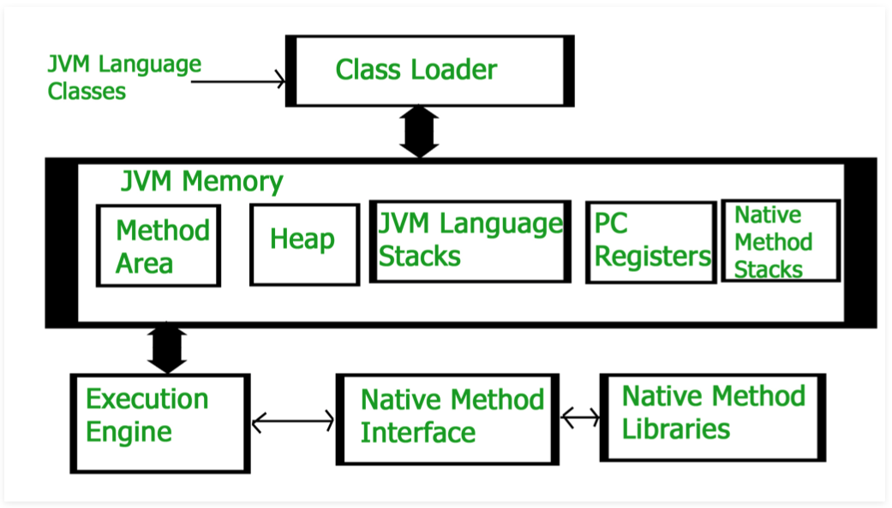
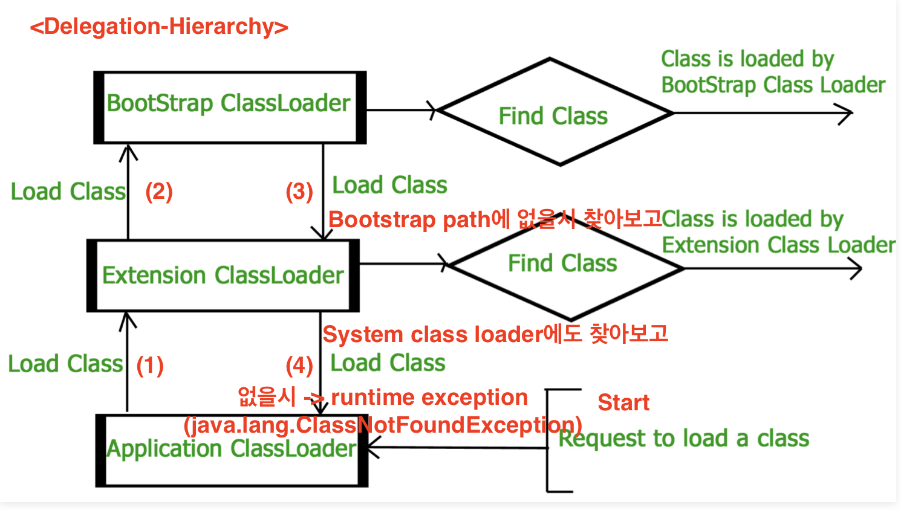
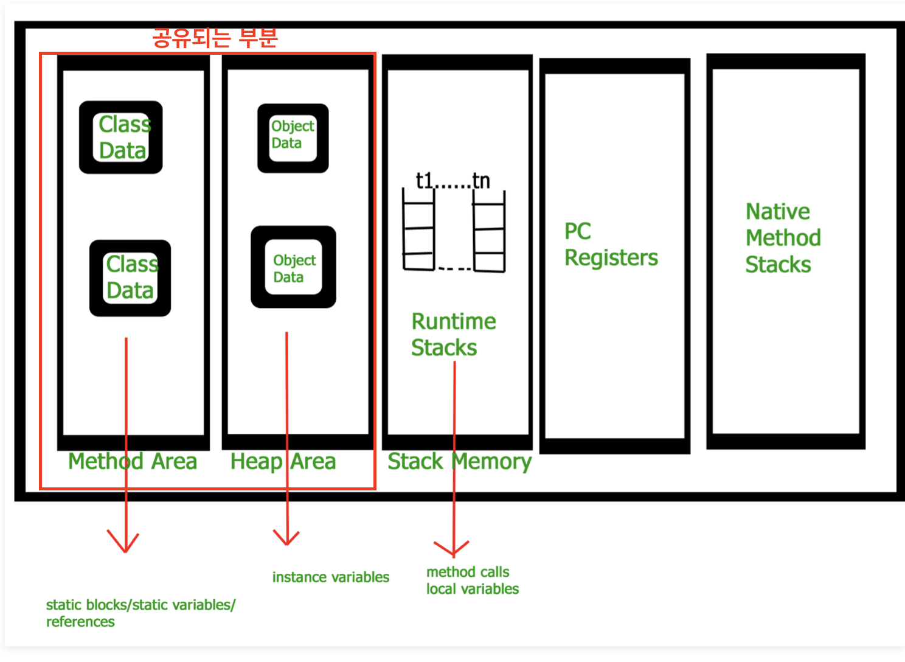

# [JRE] JVM

## JVM 이란
자바 어플리케이션을 돌리기 위한 런타임 엔진
**main** 메소드를 부르는 녀석
JRE(Java Runtime Environment)의 일부

JVM 덕에 **Write Once Run Anywhere(WORA)**가 가능

[How JVM Works - JVM Architecture? - GeeksforGeeks](https://www.geeksforgeeks.org/jvm-works-jvm-architecture/)

## 구성




### Class Loader Subsystem
* Loading
* Linking
* Initialization

#### Loading
**.class** 파일을 읽어서 binary data 생성하고, **method area**에 저장
* Fully qualified name of the loaded class and its immediate parent class
* Whether .class file is related to Class or Interface or Enum
* Modifier, Variables and Method information etc.

.class file 로딩 이후, Heap 메모리에 이 파일을 표현하기 위해 an object of type Class를 **한개** 생성(`java.lang.package`에 선언되어있음) -> class level information 획득에 사용 (class name, parent class name, methods and variable information etc…) (`getClass()`)

```java
// A Java program to demonstrate working of a Class type 
// object created by JVM to represent .class file in 
// memory. 
import java.lang.reflect.Field; 
import java.lang.reflect.Method; 
  
// Java code to demonstrate use of Class object 
// created by JVM 
public class Test 
{ 
    public static void main(String[] args) 
    { 
        Student s1 = new Student(); 
  
        // Getting hold of Class object created 
        // by JVM. 
        Class c1 = s1.getClass(); 
  
        // Printing type of object using c1. 
        System.out.println(c1.getName()); 
  
        // getting all methods in an array 
        Method m[] = c1.getDeclaredMethods(); 
        for (Method method : m) 
            System.out.println(method.getName()); 
  
        // getting all fields in an array 
        Field f[] = c1.getDeclaredFields(); 
        for (Field field : f) 
            System.out.println(field.getName()); 
    } 
} 
  
// A sample class whose information is fetched above using 
// its Class object. 
class Student 
{ 
    private String name; 
    private int roll_No; 
  
    public String getName()  {  return name;   } 
    public void setName(String name) { this.name = name; } 
    public int getRoll_no()  { return roll_No;  } 
    public void setRoll_no(int roll_no) { 
        this.roll_No = roll_no; 
    } 
} 
```


output
```
Student
getName
setName
getRoll_no
setRoll_no
name
roll_No
```


#### Linking
* Verification
**.class** file이 정확한지 검증
올바른 포맷
유효한 컴파일러에 의해 컴파일 되었는지
실패시 `java.lang.VerifiyError` (**run-time execption**)

* Preparation
JVM이 class variables위해 메모리 할당하고 초기값 설정해줌

* Resolution
symbolic references -> direct references 로 바꾸는 과정
> **symbolic reference**  
> : 참고하는 클래스의 특정 메모리 주소를 참조 관계로 구성한 것이 아닌 참조한느 대상의 이름만을 지칭하는 것  
method area를 검색하면서 연결할 것을 찾음

#### Initialization
static variables들이 code에 의해 정해진 대로 할당됨
top -> bottom
parent -> child
(class hierarchy에 따라 진행)

* Bootstrap class loader
capable of loading trusted classes
`JAVA_HOME/jre/lib`에 있는 클래스들을 로드해줌
> bootstrap path 라고도 함  
 
* Extension class loader
child of bootstrap class loader
`JAVA_HOME/jre/lib/ext(Extension path)`에 있는 extensions 로드해줌
`sun.misc.Launcher$ExtClassLoader`에 구현되어있음


* System/Application class loader
child of extension class loader
application class path에서 클래스들을 불러오는 역할
`Environment Variable`을 내부적으로 사용하는데, 이는 `java.class.path`에 연결되어있음
또한, `sun.misc.Launcher$AppClassLoader`에 구현되어있음

```java
// Java code to demonstrate Class Loader subsystem 
public class Test 
{ 
    public static void main(String[] args) 
    { 
        // String class is loaded by bootstrap loader, and 
        // bootstrap loader is not Java object, hence null 
        System.out.println(String.class.getClassLoader()); 
  
        // Test class is loaded by Application loader 
        System.out.println(Test.class.getClassLoader()); 
    } 
}     
```

Output:
```
null
sun.misc.Launcher$AppClassLoader@73d16e93
```



- - - -

### Memory
* Method area
* Heap area
* Stack area
* PC Registers
* Native method stacks
#### Method area
all class level information 저장됨
* class name
* immediate parent class name
* methods and variables information
* static variables 
* etc…
JVM 마다 하나씩 존재하여 공유되는 부분

#### Heap area
information of all objects 저장됨
JVM 마다 하나씩 존재하여 공유되는 부분

#### Stack area
JVM은 **thread별로** **run-time stack**을 만들고 Stack area에 저장
stack area의 모든 block은 **activation record/stack frame**이라고 불리며, **methods calls**을 저장
모든 local variables은 해당 frame에 같이 저장됨
thread 종료후, JVM에 의해 해당 frame은 없어짐
-> 따라서, 공유되는 부분이 아님

#### PC Registers
thread 별로 PC registers를 가지며, 현재 어디 주소를 실행중인지 저장

#### Native method stacks
모든 thread마다, 이부분을 각자 갖음
native method information을 저장



- - - -

### Execution Engine
.class(bytecode)를 실행하는 녀석
line by line 읽고, memory에서 data/information 읽고 명령어를 실행
 
* Interpreter
bytecode를 해석하고 실행
한 method가 여러번 불리면, 매번 해석해야하는 **단점**

* Just-In-Time Compiler(JIT)
interpreter의 단점을 개선하기 위해
전체 bytecode를 해석하고 native code로 바꿈
-> 매번 재해석할 필요가 없어짐

* Garbage Collector
[[Garbage Collector]]

### Java Native Interface(JNI)
**Native Method Libraries**(C/C++) 사용하기 위한 interface

### Native Method Libraries
collection of the Native Libraries(C/C++)

