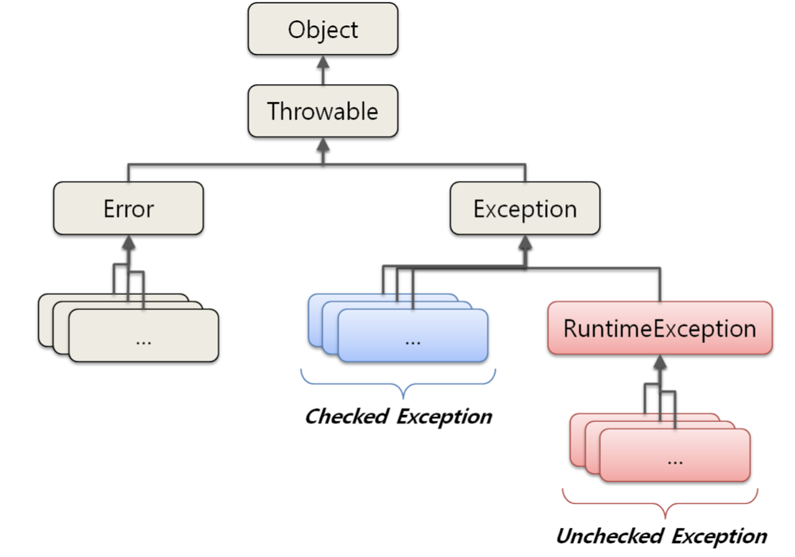

# Checked / Unchecked exception

[Java 예외(Exception) 처리에 대한 작은 생각](http://www.nextree.co.kr/p3239/)

- - - -
## Error / Exception
### Error
시스템의 비정상적인 상황시
심각한 오류
개발자가 미리 예측하여 처리할 수 없음

### Exception
개발자가 구현한 로직에서 발생
발생할 상황을 미리 예측 가능

- - - -
## Error / Exception class


- - - -
## Checked/Unchecked(Runtime) Exception
* 가장 명확한 구분 기준 == **꼭 처리를 해야 하느냐**

### Checked exception
* 명시적인 예외 처리를 해야함
* 발생시 transaction은 roll-back 하지 않음
* Runtime exception을 제외한 모든 예외
	* IOException
	* SQLException
* Compile time에 체크되는 것이 아니라, Runtime시에 원할한 프로그램 실행을 위해 try-catch를 강제하는 것이다. 그래서 Checked 이다.


### Unchecked Exception
* 명시적인 처리 강제 안함
* Runtime 에 체크
* 예외발생시 transaction을 roll-back할 수 있음
* RuntimeException 
	* NullPointerException
	* IllegalArgumentException
	* IndexOutOfBoundException
	* SystemException
* 개발자가 부주의해서 발생하는 것이 대부분

### 왜 이렇게 구분했을까?
내 생각에 두 예외의 가장 큰 차이점은 프로그램에 치명적인지 아닌지이다. 사실 Unchecked는 무시하고 넘어가도 전체 프로그램에 큰 영향이 없을지도 모른다. 하지만 Checked는 I/O와 관련된 부분이 많고 아예 전체 프로그램이 동작하지 않을 수 있다. C/C++에서는 이렇게 구분하지 않고 다 Exception으로 통일되어있다. Java는 이렇게 구분함으로써 보다 프로그램을 안정적으로 실행시키고 개발자의 실수를 줄일 수 있게끔 도와줄 수 있다.

### Oracle이 말하는 Unchecekd Exception 논쟁
[Unchecked Exceptions — The Controversy (The Java™ Tutorials >                    Essential Classes > Exceptions)](https://docs.oracle.com/javase/tutorial/essential/exceptions/runtime.html)
메소드를 통해 throw되는 Exception들은 모두 public interface에 속한다. 메소드를 부르는 것은 예외가 발생할 것을 인지하고 있고 어떻게 할지 정할 수 있다. 예외들은 그 메소드의 파라미터와 return 값처럼 인터페이스의 일부분이다.

하지만 어떤 수를 0으로 나눈다던가, null에 접근한다던가, 배열에 접근하는 인덱스가 너무 크거나 작은 것들도 Runtime Exception인데 이들은 보통 프로그래밍의 문제이다. 그렇다면 API를 문서화할때 런타임 예외까지 명시해서 하지 않는 이뉴는 무엇인가?

런타임 예외는 프로그램 어떤 부분에서든 일어날 수 있다. 하지만 모든 메소드에 이들을 명시하는 것은 프로그램이 깔끔하지 못하다. 그러므로 컴파일러는 런타임 예외를 꼭 필요로 하진 않는다.

일반적이 예로, 메소드의 파라미터를 잚못 전달할 경우 런타임 예외가 발생한다. null을 전달할 경우 NullPointerException이 발생한다. 

보통의 경우에는 RuntimeException을 throw하거나 그 subclass를 만들어서 throw하는 것은 추천하지 않는다. 프로그래머에게 힘든일만 가중하는 격이다.

가장 추천하는 방법은, 클라이언트가 예외로부터 스스로 복구될 수 있다면 checked exception이 좋다. 하지만 그렇지 못하다면 unchecked exception으로 하라.

- - - -
## 예외 처리 방법
1. 예외복구
2. 예외처리 회피
3. 예외 전환

### 예외복구
다른작업 흐름으로 유도

```java
int maxretry = MAX_RETRY;
while(maxretry --> 0) {
	try {
		// 예외 발생 가능성있는 코드 실행
		return; 
	} catch(SomeException e) {
		...
	} finally {
		// 리소스 반납 및 정리
	}
}

throw new RetryFailedException()
```

### 예외처리 회피
처리하지 않고 호출한 쪽으로 throw
```java
public void add() throws SQLException {
	// logic...
}
```


### 예외 전환
명확한 의미의 예외로 전환 후 throw

```java
catch(SQLException e) {
	...
	throw DuplicateUserIdException();
}
```

* 명확한 인지 위한 다른 예외 던짐
* Checked Exception 중 복구가 불가능한 예외가 잡히면 Unchecked로 전환해 다른 계층에서 예외 일일이 선언하지 않도록 할 수 있음


