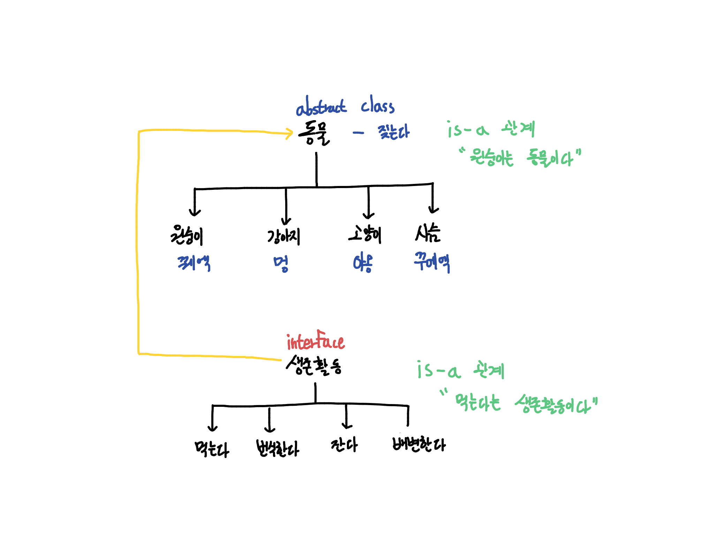

# Interface v.s. Abstract class
#ProgrammingLanguage/Java
- - - -

## 공통점
* **선언**만 존재
* **구현없음**
-> 새로운 **인스턴스** 생성 불가
- - - -
## 차이점
### Abstract class
* 공통적인 기능을 하는 객체들의 추상화에 사용
* 일반적인 추상화 및 상속에 더 초점
* **언제 사용하지는지가 중요**
	* **Is-a** 관계
	* 만들 클래스들의 **공통점을 찾아 추상화시켜 사용하는 것**
* 자바에서는 다중 상속 불가능

* `non-static` `non-final` `public` `private` `protected` 메소드 사용 가능

#### 예제
#### 원숭이, 강아지, 고양이 클래스 만들기
* 위는 동물이며 동물중 포유류라는 공통점 지님
* 따라서, **Abstract class**는 포유류의 공통점을 가지는 **젖먹이** 등을 추상화하여 생성
* 각 동물들의 고유 특성은 추상클래스를 상속하여 생성

-> C++의 virtual와 비슷해 보임

### Interface
* 구현하는 클래스들에 대해 특정 메소드가 반드시 존재하도록 강제하는 역할
* 다중 상속 가능
* **Is-A** 관계
* `public` `static` `final` 상속 가능, 모든 상속 가능한 메소드는 `public`

