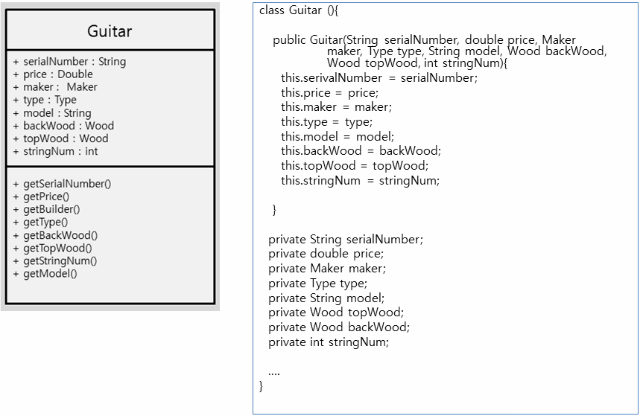
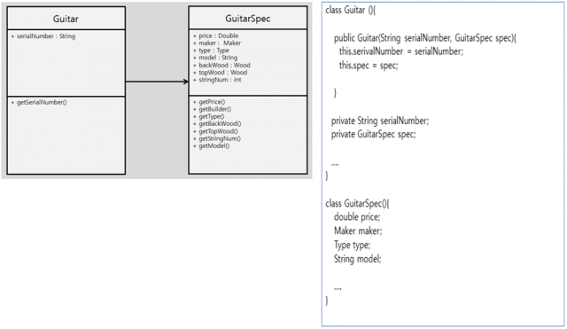
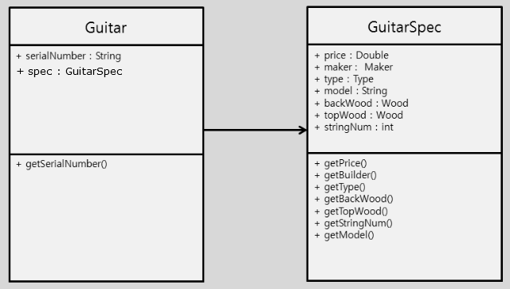
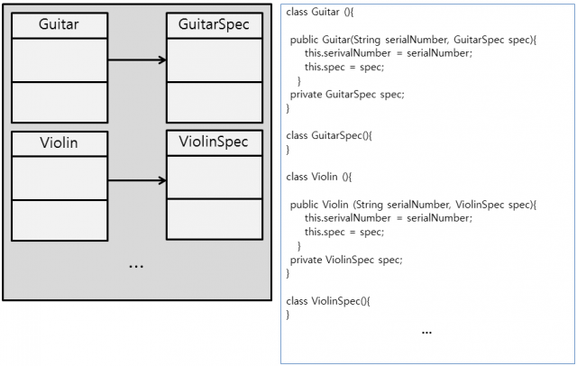
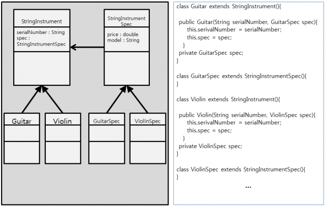
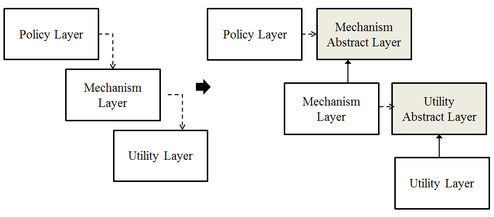

# SOLID 객치 지향 설계
#CS/oop

로버트 마틴이 2000년 초반 명명한 OOP 및 설계 다섯 가지 기본 원칙을 마이클 패더스가 두문자어 기억술로 소개한 것이다.

유지 보수와 확장이 쉬운 시스템을 개발하고싶을떄 이 원칙을 적용할 수 있다.
코드가 읽기 쉽고
확장하기 쉽게 될 때까지 리팩토링하여 
코드 스멜을 제거하기 위해 적용할 수 있다.
애쟈일과 적응적 소프트웨어 개발 전반적 전략의 일부다.

## 개요
### SRP
~단일 책임 원칙(Single Responsibility Principle)~
한 클래스는 하나의 책임만 가져야 한다.
모든 클래스는 하나의 책임만 가진다.
**책임을 완전히 캡슐화 해야한다**
제공하는 모든 기능은 책임과 부합해야한다.

~예~
보고서를 편집하고 출력하는 모듈
두 가지 이유로 변경 가능
1. 보고서의 내용에 의해
2. 보고서의 형식에 의해
하나는 실질적이며 하나는 꾸미기 위한 다른 원인에 기인
SRP는 이 문제의 두 측면이 실제로 분리된 두 책임 떄문이며, **따라서 분리된 클래스나 모듈로 나누어야한다.**
다른 시기, 이유로 변경되어야 하는 두 가지를 묶는 것은 나쁜 설계일 수 있다.
**한 클래스를 한 관심사에 집중**하도록 유지하는 이유는, 클래스를 더욱 튼튼하게 만들어주기 떄문이다. 

~장점~
책임이 확실해진다.
다른 책임 변경으로인한 사이드 이펙트에서 자유롭다.
코드 가독상 향상, 유지보수 용이하다.

~적용방법~
* 어려 원인에 의한 변경(Divergent Change)
클래스 당 하나의 책임만 갖도록한다.
분리된 클래스간 관계 복잡도를 줄이도록 설계한다.
유사 책임들이 있다면 상위 클래스로 묶고 상속한다.
* 산탄총 수술(Shotgun Srugery)
여러 곳에 분포한 책임들을 한 곳에 모아 깨끗하게 한다.
**응집성을 높인다.**

~예시~

serialNumber를 제외한 속성들은 **변화요소**로 보인다. 이 정보군에 변화가 생기면 항상 이 클래스를 수정해야하는 부담이 있으므로 extract한다.

특성 정보군을 분리하였다. 보기좋으며 변경되는 부분을 한 곳에서 관리할 수 있다.


### OCP
개방-폐쇄 원칙(Open/Close Principle)
소프트웨어 요소는 확장에는 열려 있으나 변경에는 닫혀있어야 한다.
개발에 이용된 모듈 중 하나에 수정을 가할 때 그것을 이용하는 다른 모듈을 줄줄이 고쳐야하면 해당 프로그램은 수정하기 어렵다. 
OCP는 **시스템의 구조를 올바르게 리팩토링**하여 나중에 이와 같은 유형의 **변경이 더 이상의 수정을 유발하지 않도록 하는 것**이다.
잘 적용되면, 기능 추가/변경시에 제대로 동작하고 있던 코드는 **변경하지 않아도**, 새로운 코드를 추가함으로써 기능의 추가나 변경이 가능하다.

1. 확장에 대해 열려 있다.
**동작을 확장할 수 있다**는 것을 의미한다. 요구 사항 변경시 새로운 동작을 추가해 확장
**모듈이 하는 일을 변경할 수 있다**
2. 수정에 대해 닫혀 있다.
코드를 **수정하지 않고** 모듈의 기능을 **확장하거나 변경**가능하다. 

**추상화를 통해 OCP를 달성할 수 있다.**
abstract같은 고성된 추상화가 있지만 interface나 abstract method를 새로 정의하므로써 기능의 확장이 가능하다. 

위의 법칙을 잘 지켜야 OOP의 **유연성, 재사용성, 유지보수성** 등을 얻을 수 있다. 반드시 지켜야할 **기본 원칙**이다.

~적용방법~
1. 변경(확장)될 것과 불변을 명확히 구분
2. 만나는 지점에 인터페이스 정의
3. 구현보다 인터페이스에 의존

~예시~


기타가 아니라 바이올린도 다루어야 하는 **변경**이 발생하면 같은 코드를 또 작성할 순 없는 노릇이다.
아래와 같이 리팩토링한다.

결합도는 줄어들었으며 응집도는 올라갔다.

~이슈~
1. 확장/불변 모듈 분리에서 크기 조절 실패시 더 복잡 가능성
2. 인터페이스는 가능한 변경 하지 말자.
최초 정의시 경우의 수 고려
3. 인터페이스 설계시 적당한 추상화 레벨 선택
**그래디 부치**에 따르면 ::추상화란 다른 모든 종류의 객체로부터 식별될 수 있는 객체의 본질적인 특장::
**행위**에 대한 본질적인 정의 필요


### LSP
리스코프 치환 원칙(Liskov Substitution Principle)
프로그램의 객체는 프로그램의 정확성을 깨뜨리지 않으면서 하위 타입의 인스턴스로 바꿀 수 있어야 한다.
::서브 타입은 언제나 기반 타입과 호환될 수 있어야 한다::는 원칙
> 서브타입은 기반 타입이 약속한 규약(public interface, method throwing exceptions…)을 지킨다.  
**다형성(폴리모피즘)**과 **확장성** 획득 목표
이를 위해 하위보다는 상위클래스를 사용
생성 시점에 `상위 클래스 = new 하위클래스`로 작성
하위클래스를 숨기기 위해 **abstract factory**패턴 사용가능
결국 폴리모피즘을 토한 확장원리인 LSP는 **OCP를 제공**하게된다. 
LSP를 바탕으로한 OCP는 확장부분에 다형성을 제공하여 변화에 열려있게된다.

~적용방법~
1. 두 개체가 같은 일 하면 하나의 클래스로 표현하고 구분할 필드를 둔다.
오버로딩
2. 같은 연산자지만 약간씩 다르게 하면 공통 인터페이스를 implements 한다.
3. 공통 연산없으면 별개의 클래스로 둔다.
4. 두 개체 하는 일에 추가적인 것을 원하면 구현 상속을 활용한다.

~예시~
```java
void f(){  
    LinkedList list = new LinkedList();
    // …
    modify(list);
}

void modify(LinkedList list){  
    list.add(…);
    doSomethingWith(list);
}
```
만약 `LinkedList`를 다른 자료구조로 변경하고 싶을떄, 앞으로 변경의 가능성이 있을때 공통 인터페이스를 활용하여 묶어준다. 만약 `HashSet`을 사용하고싶다면 이 둘은 `Collection` 인터페이스를 구현하고있기 때문에 이것으로 교체하면된다.

```java
void f(){  
     Collection collection = new HashSet();
     //…
     modify(list);
}

void modify(Collection collection){  
     collection.add(…);
     doSomethingWith(collection);
}
```
앞으로 있을 변경에도 유연하다. `Collection`이 LSP를 준수하기때문에 이와같은 변경을 해도 전체 기능에 차이가 없다. 
`modify()`는 닫혀있게되고 `HashSet`과 같은 변경에는 열려있게 된다. 따라서 OCP를 준수하게 된다.

~이슈~
1. 혼동 여지 없고 트레이드 오프를 고려해 선택한 것이라면 그대로 둔다.
2. 다형성위한 상속 관계 필요없다면 **Replace with Delegation**을 사용
상속은 깨지기 쉬운 기반 클래스 등을 지니므로, IS-A관계가 성립 안될수 있다. LSP지키기 어려우면 **Composition**을 사용해라.
3. 상속 구조가 필요하면 Extract Subclass, Push Down Field, Push Down Method 등의 **리팩토링** 호라용해 LSP 준수하는 상속 계층 구조 구성해라.
4. IS-A 성립해도 프로그램 전체가 그런것은 아니다. 관계 맺음은 역할과 공유하는 연산이 있는지, 연산이 어떻게 다른지 종합적으로 검토해야한다.
5. **Design by Contract**(서브 클래스에서는 기반 클래스의 사전 조건과 같거나 더 약한 수준에서 사전 조건을 대체할 수 있고, 기반 클래스의 사후 조건과 같거나 더 강한 수준에서 사후 조건을 대체할 수 있다)
LSP가 되려면, 받아들이는 선 조건에서 서브 클래스의 제약사항이 기반 클래스의 제약 사항보다 느슨하거나 같아야한다. 더 강하면 기반 클래스에서 실행되던 것들이 서브에선 강 조건에 의해 실행되지 않을 수 있다.
서브 클래스의 후 조건은 같거나 더 강해야한다. 약하면 기반 클래스의 후 조건이 통과시키지 않는 상태를 통과시킬 수도 있다.


### ISP
인터페이스 확장 원칙(Interface Segregation Principle)
특정 클라이언트를 위한 인터페이스 여러 개가 범용 하나보다 낫다.

클라이언트가 자신이 이용하지 않는 메소드에 의존하지 않아야 한다는 원칙이다. 
큰 덩어리의 인터페이스들을 **구체적이고 작은 단위로 분리**시켜 필요한 메소드만 이용할 수 있게 한다. 
작은 단위 인터페이스를 ~역할 인터페이스~라고 한다. 
내부 의존성을 약화시키고, 리팩토링, 수정, 재배포를 쉽게 한다. 

::어떤 클래스가 다른 클래스에 종속될 떄에는 가능한 최소한의 인터페이스만을 사용::해야한다. 
SRP가 단일 클래스의 단일책임을 강조한다면 ISP는 **인터페이스의 단일책임**을 강조한다.
하지만, 여러 책임 혹은 역할은 갖는 것을 인정한다. 이 경우 SRP가 분리를 통해 변화에의 적응성을 획득하고, ISP가 인터페이스 분리를 통해 같은 목표에 도달한다.

~적용방법~
1. 클래스 인터페이스를 통한 분리
상속을 이용해 인터페이스를 나눈다.
클라이언트에 변화주지 않고 분리효과획득
대부분의 OOP는 상속이용한 확장시 클래스의 성격을 디자인 시점에 규정한다.
따라서, 인터페이스 상속받는 순간 예속되어 제공되는 서비스의 성격이 제한된다.
2. 객체 인터페이스를 통한 분리
위임(Delegation)이용해 인터페이스 나눈다.
> 위임  
> 특정 일의 책임을 다른 클래스나 메소드에 맡기는 것  
다른 클래스의 기능 사용해야하지만, 변경하고 싶지 않다면 상속 대신 위임을 활용한다.

~예제~
```java
import javax.swing.event.*;  
import javax.swing.table.TableModel;

public class SimpleTableDemo ... implements TableModelListener {  
    ...
    public SimpleTableDemo() {
        ...
        table.getModel().addTableModelListener(this);
        ...
    }
    //인터페이스를 통해 노출할 기능을 구현합니다.
    public void tableChanged(TableModelEvent e) {
        int row = e.getFirstRow();
        int column = e.getColumn();
        TableModel model = (TableModel)e.getSource();
        String columnName = model.getColumnName(column);
        Object data = model.getValueAt(row, column);

        ...// Do something with the data...
    }
    ...
}
```
JTable의 코드
모든 역할을 인터페이스로 각각 분리해서 제공한다.
자신을 이용해 테이블을 만드는 객체에게는, 기능을 전부 노출하지만 이벤트 처리 관련해서는 리스너 인터페이스를 통해 해당 기능만 노출한다.

~적용이슈~
1. 이미 구현된 클라이언트에 변경을 주어서는 안된다.
2. 두 개 이상의 인터페이스가 공유하는 부분의 재사용을 극대화 한다.
3. 서로 다른 성격의 인터페이스를 명백히 분리한다.


### DIP
의존관계 역전 법칙(Dependency Inversion Principle)
프로그래머는 “추상화에 의존해야지, 구체화에 의존하면 안된다”
DI는 이 원칙을 따르는 방법 중 하나
[[DI: Dependency Injection]]
상위 계층이 하위 계층의 구현으로부터 독립되게 한다. 
1. 상위 모듈은 하위 모듈에 의존해서는 안된다. 상위 모듈과 하위 모듈 모두 추상화에 의존해야 한다.
2. 추상화는 세부 사항에 의존해서는 안된다. 세부사항이 추상화에 의존해야 한다.

**상위와 하위 객체 모두가 동일한 추상화에 의존해야 한다**는 OOP 설계 대원칙을 제공한다.

**추상**을 매개로 메시지를 주고 받아 관계를 최대한 **느슨하게**하는것

~적용방법~
::잘 구조화된 객체지향 아키텍쳐들은 각 레이어마다 잘 정의되고 통제되는 인터페이스를 통한 긴밀한 서비스들의 집합을 제공하는 레이어들로 구성::되어있다. 
Transitive Dependency가 발생했을떄, 상위 레벨 레이어가 하위 레벨 레이어를 바로 의존하지 않고 **추상레벨을 통해 의존**해야한다.
**모듈로서의 의존성에서 벗어나** 자체적으로 재사용과 확장성을 보장받는다. 


~예시~
1. 통신 프로그램
클라이언트가 서버에 Send하고 Recv할떄 Recv는 블로킹된다.
**Polling**을 사용하면 이 블로킹되는 것을 어느정도 완화할 수 있다. recv를 전담하는 쓰레드에게 맡기고 일정 시점에 도착했는지 확인하는 방법으로 구현된다. 
하지만, 지연되고 오지않을경우 재차확인하는 비용이 소모된다. 이는 오버헤드로 이어진다.
여기서 DIP를 적용할 수 있다.
recv를 담당하는 쓰레드에게 hook method를 전달한다. 
> Hook method  
> 슈퍼 클래스에서 디폴트 기능을 정의해두거나 비워뒀다가 서브 클래스에서 선택적으로 오버라이드할 수 있도록 만들어둔 메소드  
recv쓰레드는 응답을 받은 후 hook method를 실행한다. 이 메소드안에 원하는 것을 하는 것이다.
폴링에서의 잦은 응답 확인 오버헤드가 없어지고 클라이언트 쓰레드는 다른 작업을 할 수 있게 자유로워진다.
여기서 **IoC**가 일어난다. 통제권이 클라이언트 쓰레드에서 커맨드 오브젝트(훅 메소드)로 옮겨진다. 

2. 이벤트 드리븐, 콜백, JMS
자바 스윙에서 이벤트를 처리할떄 `java.awt.event.ActionListener`를 등록한다. 이는 커맨드 오브젝트이고 이 안에 훅 메소드인 `actionPerformed()`가 있다. 이벤트 발생이 이를 후킹한다.


## 참조
[위키피디아](https://ko.wikipedia.org/wiki/SOLID)
[객체지향 개발 5대 원리: SOLID](http://www.nextree.co.kr/p6960/)

